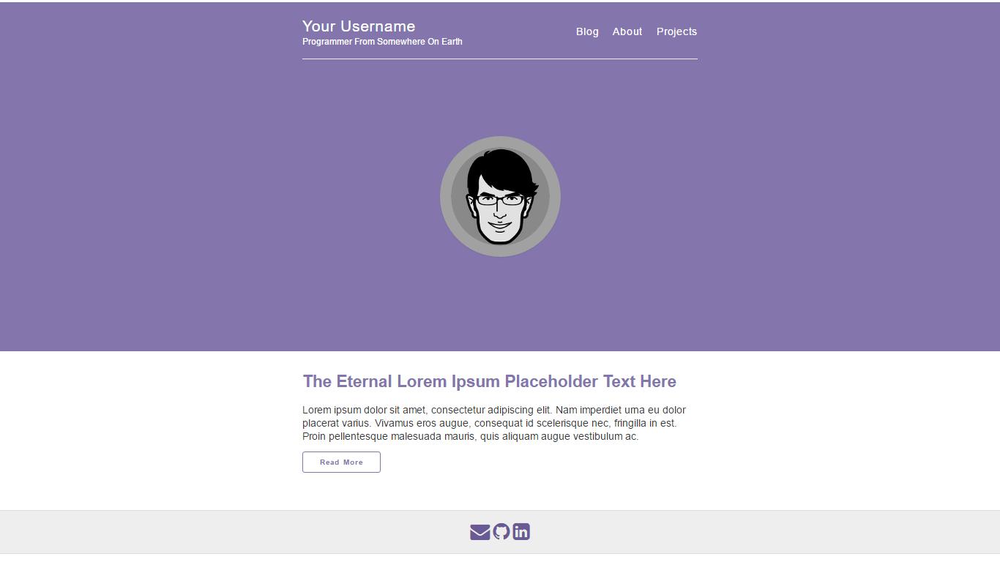

# Jekyll-Mono




Jekylly-Mono is a simple and elegant Github Profile cum Blog theme based on Barry Clark's [Jekyll-Now]("https://github.com/barryclark/jekyll-now"). It's a result of my attempt to learn Jekyll and create a minimalistic theme to put up my CV alongwith some blog posts.

Jekyll-Mono was crafted with 💙 by [Akshay Agarwal](https://github.com/AkshayAgarwal007).

## What is Jekyll?

It is a static site generator. It takes your content written in Markdown, passes it through your templates and spits it out as a complete static website, ready to be served using Github pages for free.

Because your entire blog is static it serves and perform faster. It consumes less web resources namely memory and I/O.

## Getting Started

This is the easiest way for you to set up your own blog in a matter of minutes. If you are a programmer and you want a blog where alongwith some posts you also want to put up your CV then this is the best way you can do it , blog like a hacker! And even if you are not a programmer, don't worry, Prose is there for your rescue. We'll discuss all these in this section.

### Fork this repository

Hit the “Fork” button in the top-right corner of the repository to fork a copy of this theme to your GitHub account and rename it to yourusername.github.io and then visit https://yourusername.github.io and you'll be able to see your newly created blog using Jekyll-Mono.

### Customise Jekyll-Mono

So now your blog is live with its default settings. Let's customise it now.

Edit the _config.yml and enter your site name and description. You can easily turn on Google Analytics tracking, Disqus commenting and cool loking social icons here too.

Jekyll-Mono also comes with the option of setting up the color scheme of your blog. You can do this by editing _variables.scss that lies inside the _sass folder. You can change the main theme color by simply replacing the current hex color value of `$mono` with the one of your choice. A few main theme sample colors are included in there as comments. Apart from the main theme color you can also change the header link color, navbar hover color , hyperlink color as well as the color of the various headings.

A look at the customisations you can do with _variable.scss

```
// Main theme colors 
// Some cool main theme colors(violet:#2ddbb3,#8476ad,blue:#5cacee,red:#ff7373,#ff6f69, green:#6acf64, orange:#ffa268)

$mono-color:#8476ad;                // main theme color(header, links, footer icons, buttons, post-title)
$hl-color: $darkGray;              // header link color (author name and posted on date) for blog post meta 
$navbar-hover-color:$gray;        // navbar hover color (site name and navbar links hover color)
$link-color: $darkerGray;        // normal hyperlink color other than the ones above.


// Heading colors
// You can play around with these too!
$h1-color: $mono-color;
$h2-color: $mono-color; 
$h3-color: $darkerGray; 
$h4-color: $gray;
``` 

Finally you need to set up your avatar. Pick up your avatar, resize it to 220x220px simply using paint or any editor of your choice and upload it to the images folder. Now in _variables.scss, you'll see something like this `$avatar: "images/avatar.jpg";`. Here change the avatar.jpg to what you have uploaded just now.


### Publish your blog first blog post

Publish your first blog post by editing /_posts/2016-03-06-Eternal-Lorem-Ipsum.md. Markdown Cheatsheet might come in handy while writing your blog posts in Markdown. If you are not comfortable with writing in Markdown you can use Prose for writing your blog posts. This will help you in setting up prose.

You can add additional posts in the browser on Github.com too! Just hit the + icon in /_posts/ to create new content. Just make sure to include the front-matter block at the top of each new blog post and make sure the post's filename is in this format: year-month-day-title.md


### Local Development

### Linux Users

### Jekyll-Mono Features

Since Jekyll-Mono is based on Jekyll-Now it retains most of the features of the latter.
 

### Credits

* barryclark for creating Jekyll-Now
* Manoela Ilic of codrops
* David Miller of Blackrock Digital
* Jekyll
* Font-Awesome


  